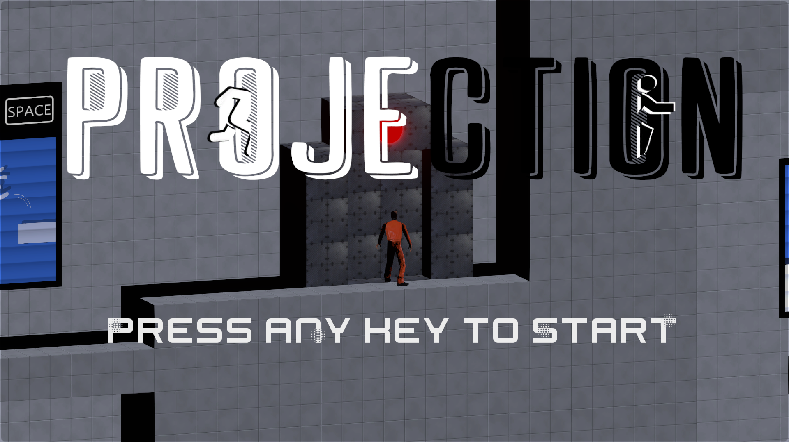
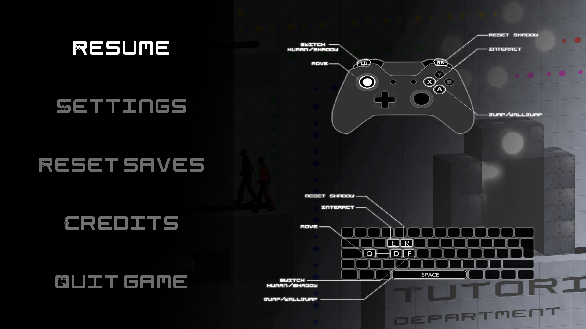
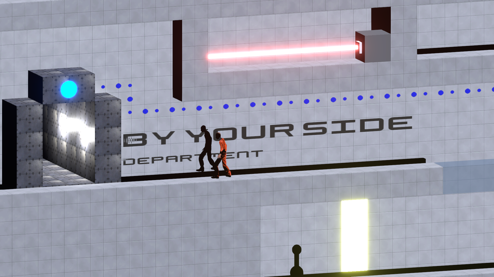
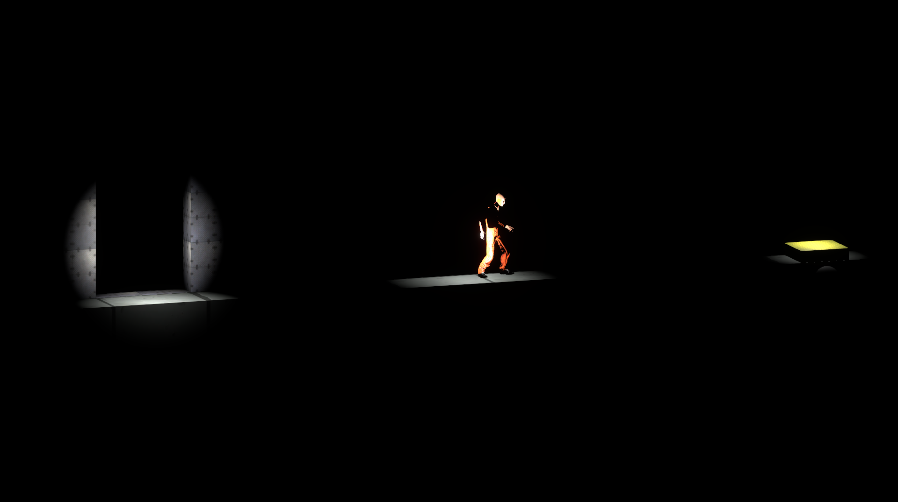
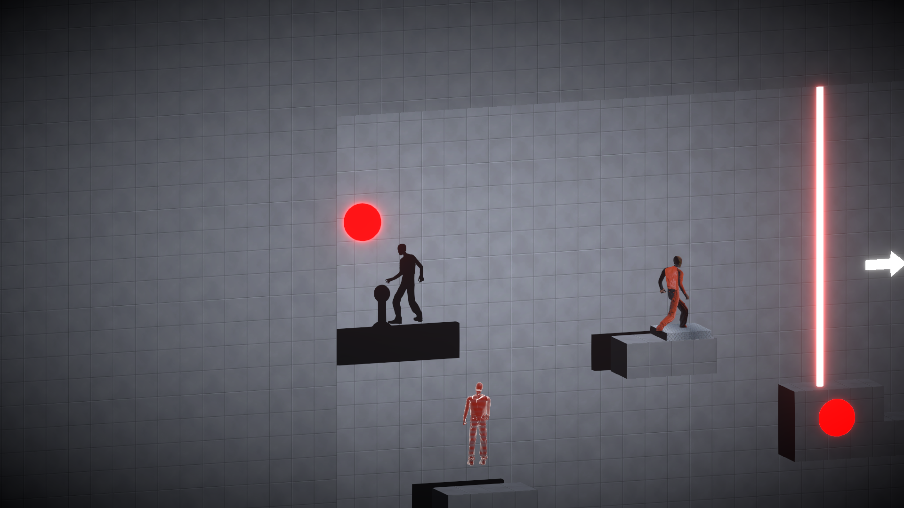
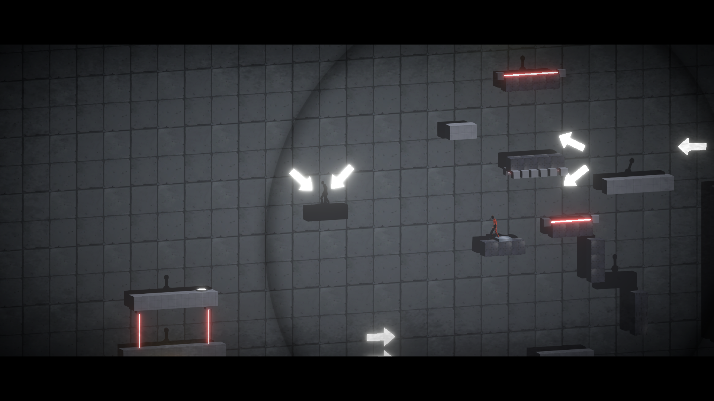
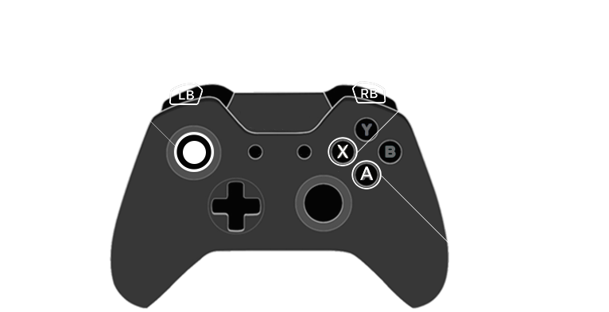
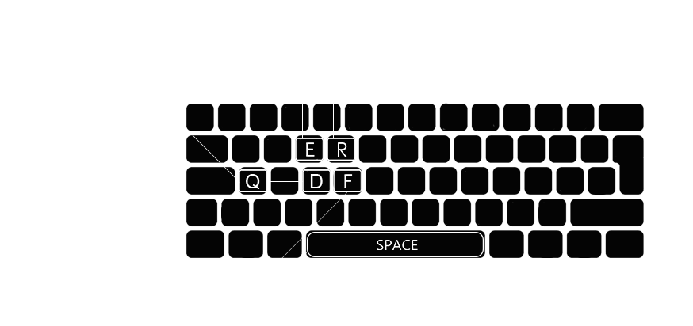

<div align="center">
  
    <a href="https://rakan.itch.io/projection">itch.io 1</a> | <a href="https://mathilde-conte.itch.io/projection">itch.io 2</a> | <a href="https://www.youtube.com/watch?v=81q4XSZM1j4">Gameplay footage</a>
</div>

<div align="center">
    <p></p>
      
</div>

## Description

Trapped as a test subject in a laboratory doing shady experiments on humans, you must overcome five experiments the scientists have designed. Work with your controllable shadow and interact with your environment to find a cunning way to survive each experiment. But beware, the shadow plane doesn't behave by the same rules you may be used to.


## Playing
To play the game, you can either:
- [download a build](https://github.com/Bad-Sam/projection/releases) and run `PROJECTION_Build.exe` in the archive
- clone this repository, open the project in Unity 2019.1.14f1 or later, and play in the editor:  
```git clone https://github.com/Bad-Sam/projection.git && cd projection```


## Controls
<div align="center">
     
</div>


## Credits
| Name            | Role              |
|-----------------|-------------------|
| Jérémy BECICA   | Game Designer     |
| Victor DUREL    | Game Designer     |
| Mathilde CONTE  | Game Designer     |
| Thibault WEGNER | Game Designer     |
| Corto GARNIER   | Game Designer     |
| Sami AMARA      | Game Programmer   |
| Thomas DALLARD  | Game Programmer   |
| Jonathan SIX    | Game Programmer   |
